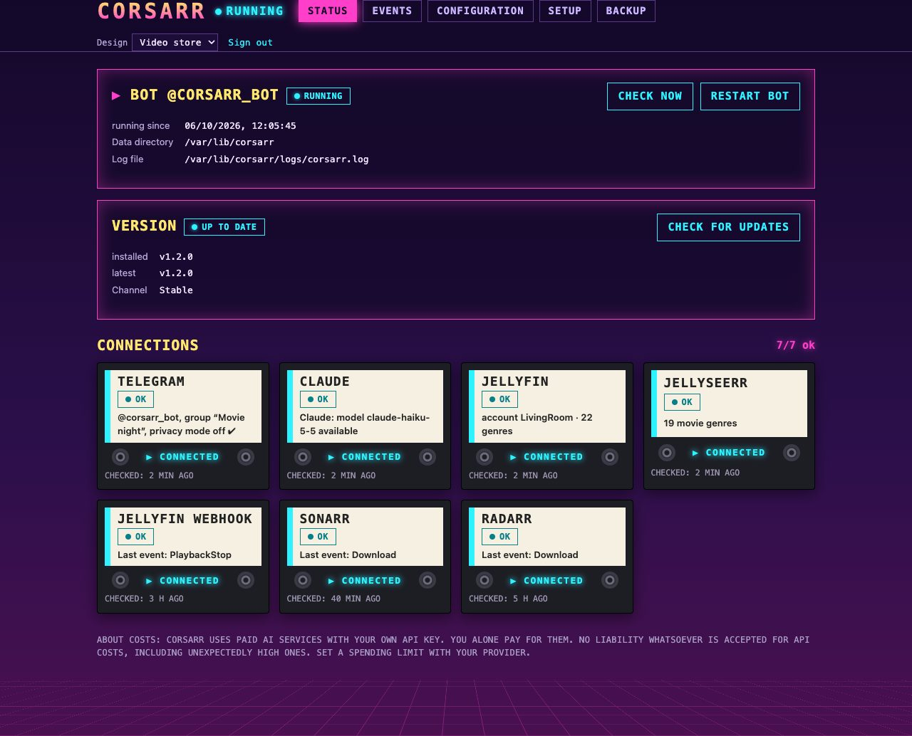

# Corsarr

A Telegram bot for movie night. Corsarr suggests movies and series to your group – from your Jellyfin
library first, plus new titles via Jellyseerr. After you've watched something, it asks how you liked it and learns your taste.
It also reports what Sonarr and Radarr downloaded, grouped together rather than one message per episode. It talks as a
🏴‍☠️ pirate, a 📱 Gen Z character or plainly, and replies in whatever language you write to it in (English or
German). Powered by Claude Haiku via the Claude API, with a web interface for status, events and
configuration.

## Features

- **Suggestions:** `@bot find us a thriller for tonight` → 5–6 titles as **one browsable card** (◀️ ▶️):
  the first 1–2 from your library, the rest new. Each comes with a poster, a reason why it fits and a 🎬 trailer link.
  Buttons: ✅ Let's watch · 📥 Request (via Jellyseerr) · 🙅 Not interested.
- **Based on your history:** `@bot what fits what we watched lately?`
- **Feedback:** movie finished, season done, series paused, movie abandoned – the bot asks and remembers
  free text like "too gory" as *less: gore*.
- **Download notifications:** new episodes one by one, backfilled seasons as a single message
  ("📦 Grey's Anatomy: 48 episodes from seasons 1–4 are ready").
- **Web interface** on port 8787: connection status of every service, live event log, full configuration.
  No config file needed.



## Quick start

**Proxmox LXC** (Debian 12, 1 core, 512 MB) – as root inside the container:

```bash
bash -c "$(curl -fsSL https://raw.githubusercontent.com/ironiro/corsarr/main/deploy/install.sh)"
```

**Docker:**

```bash
curl -fsSLO https://raw.githubusercontent.com/ironiro/corsarr/main/docker-compose.yml
docker compose up -d
```

Then open `http://<ip>:8787/` and enter your Telegram, Claude, Jellyfin and Jellyseerr details under **Configuration**.
To update, run the same command again, or run `docker compose pull && docker compose up -d`.

## Documentation

| | |
| --- | --- |
| [Installation](docs/Installation.md) | LXC, Docker, manual, macOS/Windows |
| [Setup](docs/Setup.md) | Telegram bot, chat id, keys for Claude/Jellyfin/Jellyseerr |
| [Configuration](docs/Configuration.md) | All settings and the web interface |
| [Webhooks](docs/Webhooks.md) | Jellyfin (feedback), Sonarr/Radarr (download notifications) |
| [Usage](docs/Usage.md) | What to write to the bot, buttons, feedback rules |
| [Operations](docs/Operations.md) | Logs, updates, backups, moving to another host |
| [Troubleshooting](docs/Troubleshooting.md) | Common problems |
| [Development](docs/Development.md) | Architecture, tests, adding a language |

## Development

```bash
python3.12 -m venv .venv && .venv/bin/pip install -r requirements.txt pytest
.venv/bin/python -m pytest -q
.venv/bin/python -m corsarr
```

The tests need no credentials and no running services. Details: [Development](docs/Development.md).

## License

[GPL-3.0](LICENSE) – free to use, study, modify and share. If you distribute a modified version, its
source code must be available under the same licence.
