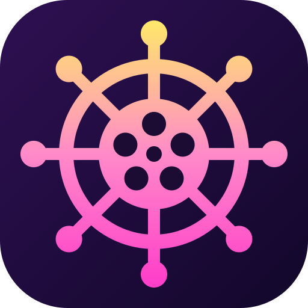
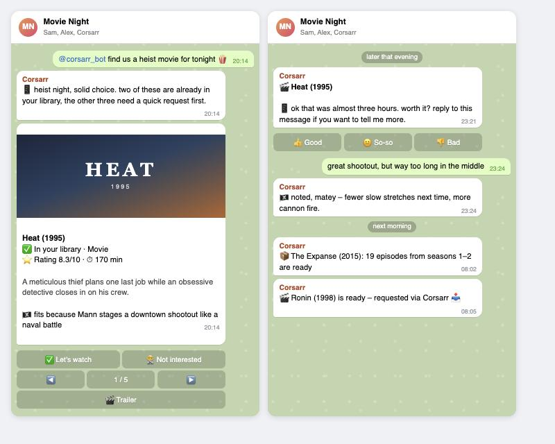
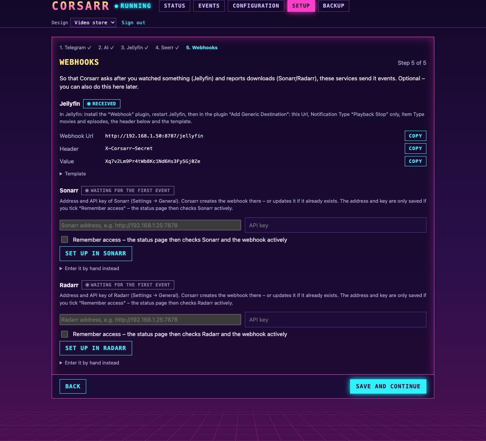
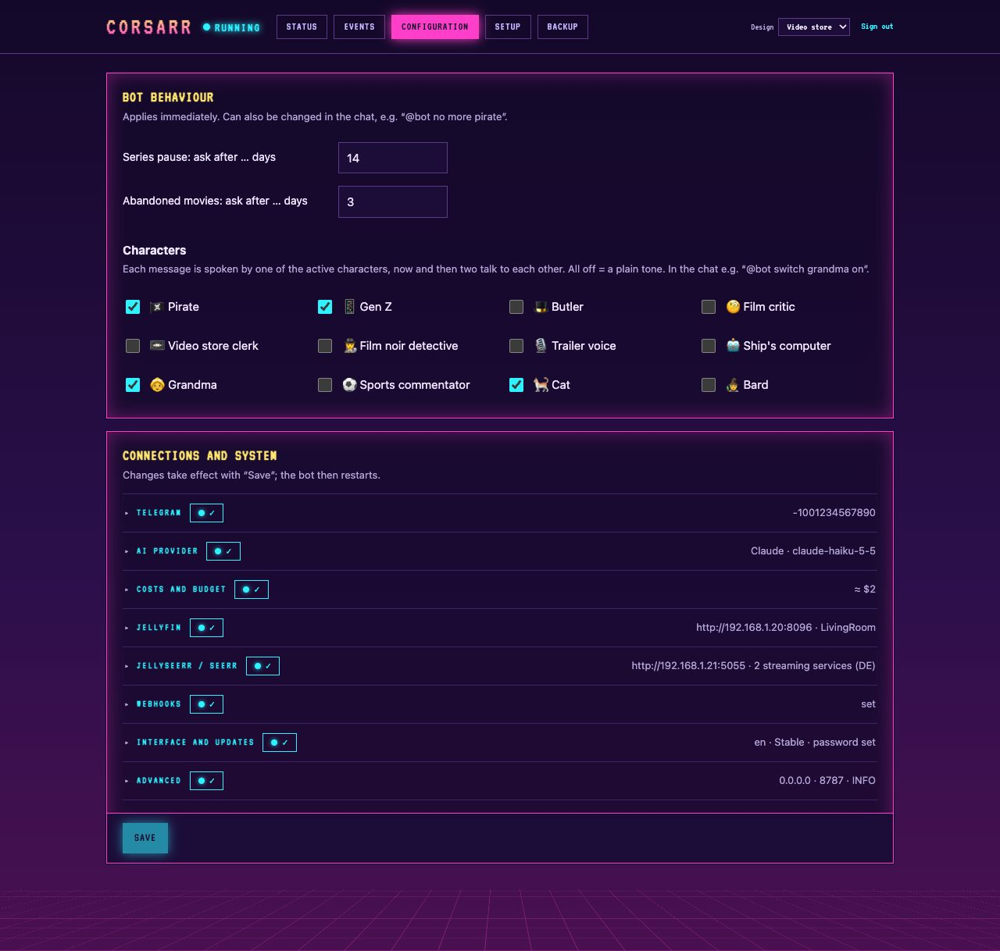
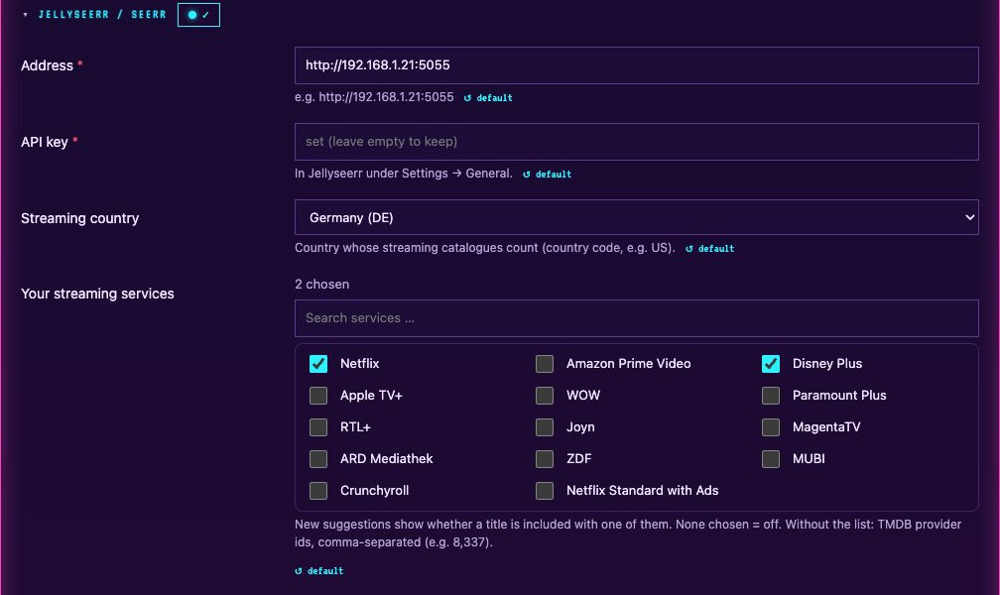
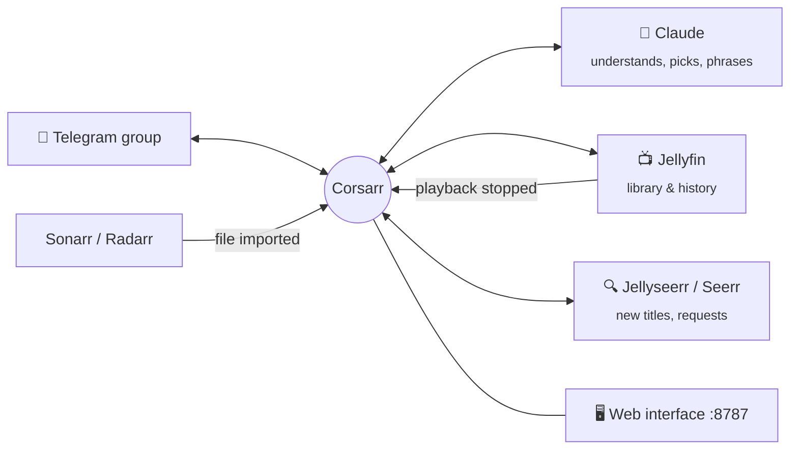

<p align="center">
  
</p>

<h1 align="center">Corsarr</h1>

<p align="center">
  <b>Your movie night crew on Telegram.</b><br>
  Picks films and series from your Jellyfin library and beyond, asks how you liked them,<br>
  learns your taste – and tells you when Sonarr and Radarr are done.
</p>

<p align="center">
  <a href="https://github.com/ironiro/corsarr/tags"></a>
  <a href="https://github.com/ironiro/corsarr/actions/workflows/ci.yml"></a>
  <a href="https://github.com/ironiro/corsarr/pkgs/container/corsarr"></a>
  
  <a href="LICENSE"></a>
</p>

<p align="center">
  <a href="#-quick-start">Quick start</a> ·
  <a href="docs/Home.md">Documentation</a> ·
  <a href="#-screenshots">Screenshots</a> ·
  <a href="https://github.com/ironiro/corsarr/issues/new/choose">Report a bug</a> ·
  <a href="https://github.com/ironiro/corsarr/issues/new?template=feature_request.yml">Request a feature</a>
</p>

<p align="center">
  
  <br><sub>Illustration with made-up names.</sub>
</p>

---

## ✨ Features

**🎬 Suggestions that fit**
- `@bot find us a thriller for tonight, max 2 hours` → 5–6 picks as **one browsable card**: a taste of your
  library first, then new titles – each with poster, rating, runtime, a reason why it fits and a trailer.
- **Look up a title** by name or by its plot: *"what's the film where the guy was dead all along?"*
- **Whole film series** with one button: *"get us all the Mission: Impossible films"*.
- **Where to stream it** – cards for new titles name the streaming services you subscribe to.

**❤️ Learns your taste – both of you**
- Asks after the movie, after a season, when a series stalls or a movie was abandoned.
- **Each of you rates for yourself**; suggestions respect both tastes and avoid what one of you dislikes.
- Free text like *"too gory"* becomes *less: gore* for future picks.

**📦 Download notifications without the spam**
- New episodes one by one, a backfilled season as **one** message, missed webhooks caught up automatically.

**🏴‍☠️ Personality**
- Twelve characters – pirate, Gen Z, butler, film critic, video store clerk, noir detective, trailer voice,
  ship's computer, grandma, sports commentator, cat and bard – switched on and off in the chat.
- Answers in **whatever language** you write in.

**🖥️ A web interface for everything else**
- **Setup assistant** that finds your Telegram group by itself and creates the Sonarr/Radarr webhooks.
- Connection status with active checks, usage and **estimated cost with an optional monthly budget**,
  live event log, encrypted **backup and restore**, stable/beta **update channels** – in four designs.

## 🚀 Quick start

**Proxmox** (recommended) – in the Proxmox host shell; creates a Debian 12 container (1 core, 512 MB) and
installs Corsarr in it:

```bash
bash -c "$(curl -fsSL https://raw.githubusercontent.com/ironiro/corsarr/main/deploy/proxmox.sh)"
```

**Docker** – images for amd64 and arm64 on `ghcr.io/ironiro/corsarr` (`:latest`, `:beta`, `:edge`):

```bash
curl -fsSLO https://raw.githubusercontent.com/ironiro/corsarr/main/docker-compose.yml
docker compose up -d
```

Then open **`http://<ip>:8787/`** – the setup assistant walks you through Telegram, the AI provider, Jellyfin,
Jellyseerr/Seerr and the webhooks, and tests each connection before saving it.
Other ways to install (existing LXC, manual, macOS/Windows): [Installation](docs/Installation.md).

**You need:** a Telegram bot ([@BotFather](https://t.me/BotFather)), a Claude API key with a few dollars of credit,
Jellyfin, and Jellyseerr or Seerr. Sonarr and Radarr are optional.

## 📸 Screenshots

| Status & costs | Setup assistant |
| --- | --- |
| [](docs/images/status.jpg) | [](docs/images/setup.jpg) |
| **Configuration** | **Streaming services** |
| [](docs/images/configuration.jpg) | [](docs/images/streaming.jpg) |

Four designs to pick from in the interface: **Video store** (shown), **\*arr**, **Terminal** and **Friendly**.

## 🧭 How it works



The code delivers every fact – titles, plots, ratings, availability – and the model only picks and phrases.
Download notifications and all status checks run without the model.

## 💸 What does it cost?

Corsarr is free. With **Claude Haiku**, one suggestion request costs about **$0.002**, so $5 of credit lasts well
over a year of normal use. The status page shows your own usage and cost, and an optional monthly budget pauses
the bot when it is used up ([details](docs/Home.md#what-does-it-cost)).

OpenAI, Google Gemini, Ollama and LM Studio can be selected too, but are **untested** – Claude is recommended.

> [!WARNING]
> **Cost disclaimer:** Corsarr calls paid AI services with *your own* API key, and you alone pay for that usage.
> The author accepts **no responsibility or liability whatsoever for API costs** – including unexpectedly high
> costs caused by bugs, misconfiguration, expensive models or misuse. Always set a spending limit with your
> provider. Use at your own risk.

## 📚 Documentation

| | |
| --- | --- |
| [Installation](docs/Installation.md) | Proxmox LXC, Docker, manual, macOS/Windows |
| [Setup](docs/Setup.md) | The setup assistant, and where each value comes from |
| [Configuration](docs/Configuration.md) | All settings and the web interface |
| [Webhooks](docs/Webhooks.md) | Jellyfin (feedback), Sonarr/Radarr (download notifications), status checks |
| [Usage](docs/Usage.md) | What to write to the bot, buttons, characters, feedback |
| [Operations](docs/Operations.md) | Logs, updates and release channels, backups, costs |
| [Troubleshooting](docs/Troubleshooting.md) | Common problems |
| [Development](docs/Development.md) | Architecture, tests, releases, adding a language |

## 🤝 Contributing

Bug reports and ideas are welcome – please use the [issue templates](https://github.com/ironiro/corsarr/issues/new/choose).
Pull requests too: see [CONTRIBUTING.md](CONTRIBUTING.md). Found a security problem? Please read
[SECURITY.md](SECURITY.md) instead of opening a public issue.

```bash
python3.12 -m venv .venv && .venv/bin/pip install -r requirements.txt pytest
.venv/bin/python -m pytest -q      # no credentials or running services needed
.venv/bin/python -m corsarr
```

What changed in each release: [CHANGELOG.md](CHANGELOG.md).

## 🙏 Built on

[Jellyfin](https://jellyfin.org) · [Jellyseerr / Seerr](https://github.com/seerr-team/seerr) ·
[Sonarr](https://sonarr.tv) · [Radarr](https://radarr.video) · [TMDB](https://www.themoviedb.org) ·
[Claude](https://www.anthropic.com/claude) · [python-telegram-bot](https://python-telegram-bot.org)

This product uses the TMDB API but is not endorsed or certified by TMDB.

## 📄 License

[GPL-3.0](LICENSE) – free to use, study, modify and share. If you distribute a modified version, its
source code must be available under the same licence.
The web interface bundles the fonts VT323 and Nunito under the
[SIL Open Font License 1.1](corsarr/web/fonts/).
