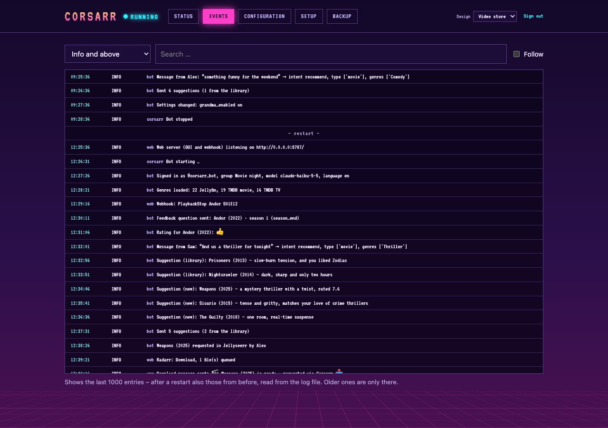

# Configuration

## Where values come from

Each value can come from one of three sources. If it is set in more than one, the first in this list wins:

1. **Web interface** – stored in `config.json` in the data directory
2. **Environment variables** – e.g. `/etc/corsarr.env` (loaded by the systemd service if present) or
   `environment:` / `env_file:` with Docker
3. **`.env`** in the start directory, or the file `CORSARR_ENV_FILE` points to

Normally you only need the web interface. Files are useful for automated setups. The web
interface shows where each value currently comes from; **reset** discards the GUI value and uses the
one from the environment or file again. Template with all names:
[`.env.example`](https://github.com/ironiro/corsarr/blob/main/.env.example).

If a required value is missing, only the web interface runs and shows what is missing under Status. The
Telegram part starts as soon as everything is there.

## All settings

### Telegram

| Name | Required | Meaning |
| --- | --- | --- |
| `TELEGRAM_BOT_TOKEN` | yes | Token from @BotFather. Never shown in the web interface. |
| `TELEGRAM_CHAT_ID` | yes | Id of the group (negative, often starting with `-100`). The bot only responds in this group. |
| `NOTIFY_CHAT_ID` | – | Separate chat for Sonarr/Radarr download notifications. If empty, the main group is used. The bot must be a member there. |

### Claude API

| Name | Required | Meaning |
| --- | --- | --- |
| `ANTHROPIC_API_KEY` | yes | API key from the Claude Console. |
| `CLAUDE_MODEL` | – | Default `claude-haiku-5-5`. |

### Jellyfin

| Name | Required | Meaning |
| --- | --- | --- |
| `JELLYFIN_URL` | yes | e.g. `http://192.168.1.20:8096` |
| `JELLYFIN_API_KEY` | yes | Dashboard → API Keys |
| `JELLYFIN_USER` | yes | Name or id of the shared account |

### Jellyseerr

| Name | Required | Meaning |
| --- | --- | --- |
| `JELLYSEERR_URL` | yes | e.g. `http://192.168.1.21:5055` |
| `JELLYSEERR_API_KEY` | yes | Settings → General → API Key |

### Web server and webhooks

| Name | Required | Meaning |
| --- | --- | --- |
| `WEBHOOK_HOST` | – | Address the web server listens on. Default `0.0.0.0` (all). Takes effect after restarting the program. |
| `WEBHOOK_PORT` | – | Default `8787`. Takes effect after restarting the program. |
| `WEBHOOK_SECRET` | yes* | Shared secret for Jellyfin, Sonarr and Radarr. *Generated automatically on first start and shown in the web interface. |
| `ADMIN_PASSWORD` | – | Password for the web interface. Empty = no login. |

### System

| Name | Meaning |
| --- | --- |
| `LANGUAGE` | `en` (default) or `de` – language of the web interface, and of the bot until someone writes to it. After that the bot answers in the language of each message. The log is always English. |
| `LOG_LEVEL` | `DEBUG`, `INFO` (default), `WARNING`, `ERROR` |
| `DATA_DIR` | Data directory. **Only** via environment/`.env`, not in the web interface. LXC: `/var/lib/corsarr`, Docker: `/data`, run manually: `./data` |

Saving changes in the web interface restarts the Telegram part within the running program – no systemd or container
restart needed. Exception: `WEBHOOK_HOST`/`WEBHOOK_PORT` (the web server itself) – restart the whole program
for those (`systemctl restart corsarr` or `docker compose restart`).

## Bot behaviour

These settings live in the database, apply immediately and can also be changed in the chat.

| Setting | Default | In the chat, e.g. |
| --- | --- | --- |
| Series pause: ask after … days (1–365) | 14 | `@bot ask about series only after 3 weeks` |
| Abandoned movies: ask after … days (1–60) | 3 | `@bot ask about abandoned movies after 5 days` |
| 🏴‍☠️ Pirate active | on | `@bot no more pirate` |
| 📱 Gen Z active | on | `@bot Gen Z back on` |

With both characters off, the bot writes in a plain, neutral style.

## The web interface

`http://<bot-ip>:8787/`

- **Status:** state of the bot and of every connection (Telegram, Claude, Jellyfin, Jellyseerr, Jellyfin
  webhook, Sonarr, Radarr) – OK/error with message and time. Checked every 5 minutes (for Claude, only the key
  and model, which is free) and also whenever the bot actually uses a service. Buttons: *Check now*,
  *Restart bot*.

- **Events:** the last 1000 log entries since start, live, with filter and search. Among other things it
  shows every message to the bot and how it understood it, every suggestion with its reason and every
  notification.

- **Configuration:** everything above. API keys are never shown – an empty field means "unchanged".

Without `ADMIN_PASSWORD` anyone on your home network can open the web interface and change settings, so
**don't forward port 8787 to the internet**. Other websites still cannot trigger anything through your
browser (cross-site request protection is always on).

If you forget the password: delete the `ADMIN_PASSWORD` entry from `config.json` in the data directory and restart
the bot.
