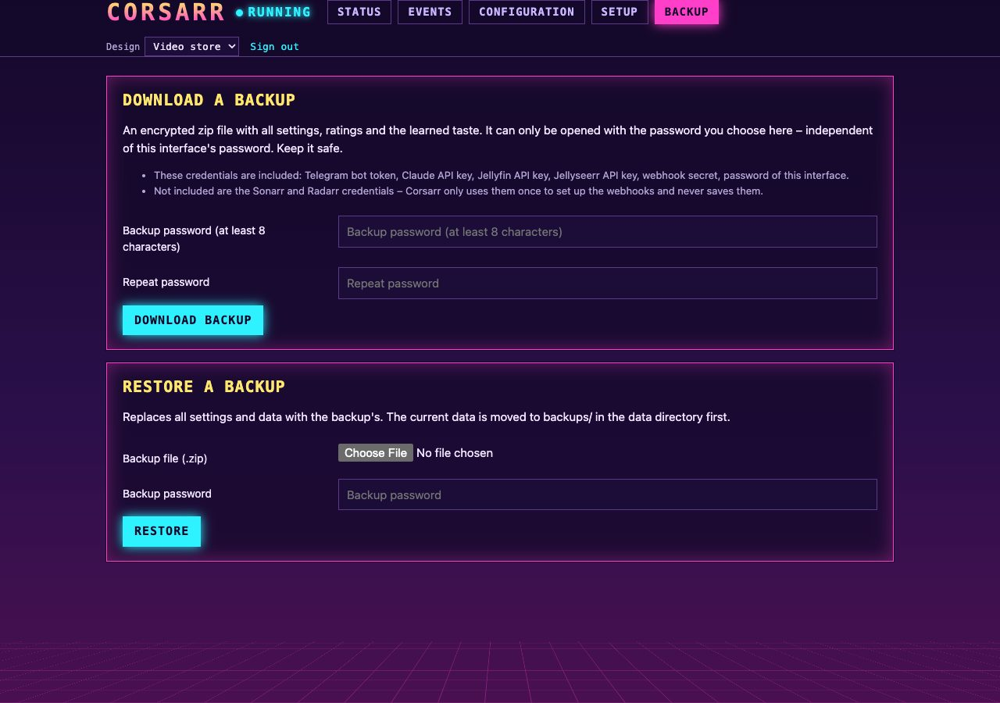

# Operations

## Where things live

| | LXC / manual | Docker | run manually |
| --- | --- | --- | --- |
| Code | `/opt/corsarr` | in the image | repository directory |
| Data | `/var/lib/corsarr` | volume `corsarr-data` → `/data` | `./data` |

In the data directory:

| File | Contents |
| --- | --- |
| `corsarr.db` | SQLite: suggestions, rejections, ratings, traits, bot behaviour, download notifications |
| `config.json` | Settings from the web interface – **contains API keys**, readable by the owner only |
| `logs/corsarr.log` | Log, rotated at 2 MB, 5 old files kept |
| `backups/` | Copies of the data replaced by a restore in the web interface (`pre-restore-…`) |

Outside it, on the LXC installation (owned by root, so the app cannot touch them):

| Path | Contents |
| --- | --- |
| `/var/backups/corsarr/pre-update-<date>-<version>/` | Database and settings from before each update, the last five |
| `/var/log/corsarr/update.log` | Output of the last update started in the web interface |
| `/etc/corsarr.env` | Optional settings as environment variables (mode `0600`) |

## Logs

- Web interface → **Events** (the last 1000 entries, also from before a restart – marked "— restart —")
- LXC: `journalctl -u corsarr -f`
- Docker: `docker compose logs -f`
- File: `logs/corsarr.log` in the data directory

For more detail, set *Configuration → Advanced → Log level* to `DEBUG` in the web interface.

## Start, stop, restart

| | LXC / manual | Docker |
| --- | --- | --- |
| Status | `systemctl status corsarr` | `docker compose ps` |
| Restart | `systemctl restart corsarr` | `docker compose restart` |
| Stop | `systemctl stop corsarr` | `docker compose stop` |

To restart only the Telegram part (e.g. after a network problem): web interface → Status → *Restart bot*.

## Update

### Release channels

| Channel | What you get | Docker image |
| --- | --- | --- |
| **Stable** (default) | Tested releases (`v1.2.0`) | `:latest` or `:stable` |
| **Beta** | Pre-releases (`v1.3.0-beta.1`), plus a stable release when it is newer than every beta – new features earlier, may have bugs | `:beta` |
| **Development** | Every commit on `main` – for developers | `:edge` |

Releases are git tags `vX.Y.Z` (stable) and `vX.Y.Z-beta.N` (beta). Choose the channel under
**Configuration → Interface and updates → Update channel**. With Docker the channel follows the image tag in
`docker-compose.yml`; a fixed version such as `:1.2.0` never changes on its own.

Before every update the installer copies the database and settings to
`/var/backups/corsarr/pre-update-<date>-<version>/` (root only; the last five are kept). The update is prepared
next to the running version – the code is fetched and a new Python environment is built first – and only then
switched in. If the new version does not answer within 30 seconds, the installer **rolls back**: previous
code and environment are put back, the database is restored from that copy if the new version had already
converted it, and the previous version is started again. The installer's output (web interface → *Output of
the last update*, or `/var/log/corsarr/update.log`) then ends with `Error: Update to … failed – rolled back`.

**Going back to an older version:** if your channel's newest release is older than the running one (e.g. after
switching from beta to stable), the web interface offers it as *Switch to … (older)* and warns first.
Database and configuration carry format versions: if the newer version already converted the database, the
older one refuses to start and says so in the web interface instead of damaging the data. Then either update
to the newer version again, or stop Corsarr and copy `corsarr.db` and `config.json` back from the
`pre-update-…` backup (as the service user, e.g. `runuser -u corsarr -- cp …`, and delete `corsarr.db-wal`
and `corsarr.db-shm` next to it). Configurations from older versions are always taken over.

### Updating

**From the web interface:** under **Status → Version** Corsarr shows the installed version, the newest one in
your channel with its release notes (or the list of commits on the development channel). With the LXC/Proxmox installation, **Update now** installs it:
the app drops a request file, a small root service (`corsarr-update.path`) runs the installer, and Corsarr
restarts. The page reconnects by itself and shows the installer's output. With Docker or a manual install,
the page shows the command to run instead.

Installations made before this feature existed get the update service with the next command-line update
below; after that the button works.

On the command line:

- **LXC:** in the Proxmox host shell `pct exec <id> -- bash -c "curl -fsSL https://raw.githubusercontent.com/ironiro/corsarr/main/deploy/install.sh | bash"` (see [Installation](Installation.md#update)).
- **Docker:** `docker compose pull && docker compose up -d`
- **Manual:** `cd /opt/corsarr && git fetch --tags && git checkout v1.2.0 && .venv/bin/pip install -r requirements.txt && systemctl restart corsarr` (or `git pull` on `main` for the development version)

An update started in the web interface or with `install.sh` may take a few minutes (it builds a fresh Python
environment); it gives up after 20 minutes or when a download stalls, and leaves the running version untouched.

The database is upgraded automatically on start. Settings are kept.

## Backup

### In the web interface



The **Backup** tab downloads an AES-encrypted zip with all settings, ratings and the learned taste.

- **Password:** you choose a password for the zip (at least 8 characters), independent of the web
  interface's. Downloading requires a web interface password (`ADMIN_PASSWORD`), because the file contains
  credentials.
- **Contents:** the credentials that are set – Telegram bot token, the AI provider's API key, the Jellyfin and
  Jellyseerr API keys, the webhook secret and the web interface password – and the Sonarr/Radarr API keys
  only if you chose *Remember access* for them. The page lists which ones are included.
- **Restore:** upload the zip and enter its password – also on a fresh installation on another machine, where
  the setup assistant offers *Restore a backup* as the first step and no login is needed. The data being
  replaced is moved to `backups/pre-restore-…` in the data directory, and the bot restarts.
- **Versions:** backups from older versions are taken over; a backup from a newer version is refused until you
  update.
- **Opening the zip yourself:** macOS's Archive Utility can't open AES-encrypted zips; 7-Zip, Keka and `7z`
  can. Corsarr itself doesn't need that.

### By hand

It is enough to back up the data directory – most importantly `corsarr.db` and `config.json`.

```bash
# LXC – while running, consistent thanks to SQLite's backup (once: apt install sqlite3)
sqlite3 /var/lib/corsarr/corsarr.db ".backup /root/corsarr-backup.db"
cp /var/lib/corsarr/config.json /root/corsarr-config.json
```

Proxmox: a normal container backup (vzdump) contains everything.

## Moving (e.g. from a laptop to the server)

**Easiest:** download a backup on the old machine (tab *Backup*), [install](Installation.md) on the new one
and choose *Restore a backup* in its setup assistant. Then continue with steps 4 and 5 below.

**By hand:**

1. [Install](Installation.md) on the new machine.
2. Stop the service there, copy `corsarr.db` and `config.json` from the old data directory into the new one
   and fix the file ownership (LXC: `chown corsarr:corsarr /var/lib/corsarr/*`, Docker directory: `chown 1000:1000`).
3. Start the service. Learned taste, settings and the webhook secret are carried over.
4. In **Jellyfin, Sonarr and Radarr** change the webhook address to the new IP. For Sonarr and Radarr,
   *Setup → Webhooks → Set up in …* updates the existing webhook for you.
5. Stop the old bot – two bots with the same token interfere with each other.

Upgrading from the old name Filmbot: a `filmbot.db` in the data directory is automatically adopted as
`corsarr.db` on the first start.

## Keeping an eye on costs

The **Usage** card on the status page shows calls, tokens and the estimated cost for today, this month and
all time, and what the calls were for. The estimate uses Anthropic's list prices including prompt caching;
the [Claude Console](https://console.anthropic.com/) shows the real bill under *Usage* and the provider's
own monthly limit under *Limits*. The automatic status checks cost nothing; you only pay when the bot
interprets or writes messages.

**Monthly budget** (*Configuration → Costs and budget*): when this month's estimate reaches it, the bot pauses
like during an outage – it says so once in the group and spends nothing more – until the next month starts
or you raise the budget (takes effect immediately). At 80 % a warning arrives first. Warnings go to the group,
or privately to you: write to the bot once in a private chat (e.g. `/start`), then pick yourself as
*Admin chat for warnings* – Telegram only lets a bot write to people who wrote to it first. The budget only
works for Claude; for OpenAI and Gemini Corsarr knows no prices. It does not replace the limit at the provider.
