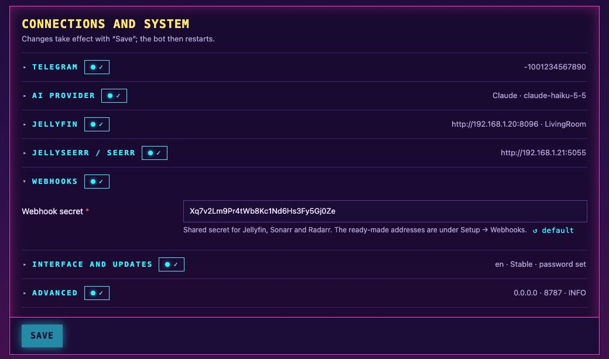

# Webhooks

With a webhook, **the other service calls the bot** – not the other way round. That's why Jellyfin, Sonarr
and Radarr always get the address **of the bot**: `http://<bot-ip>:8787/…`.

All three use the same **webhook secret**, generated on first start. The easiest way is the
**Setup → Webhooks** step of the [setup assistant](Setup.md#the-setup-assistant): it shows the complete
addresses with the secret filled in, each with a *Copy* button, and can create the Sonarr and Radarr webhooks
for you. The secret itself is also under *Configuration → Webhooks*:



You can see whether webhooks are arriving under **Status** (one tile per service) and under **Events**.

Tip: give the bot's machine a **static IP**. If its address changes, the webhooks no longer reach it.

## Jellyfin – feedback after watching

Jellyfin reports when playback stops. The bot reads everything else (progress, watched state, whether a season is complete)
directly from Jellyfin.

1. Dashboard → *Plugins* → *Catalog* → install **Webhook**.
2. Restart Jellyfin – preferably on the server with `systemctl restart jellyfin`
   (→ [Troubleshooting](Troubleshooting.md#jellyfin-doesnt-start-after-installing-a-plugin)).
3. Dashboard → *Plugins* → open **Webhook**.
   - **Server Url** (at the very top): the address of **Jellyfin** itself, e.g. `http://192.168.1.20:8096`.
     The plugin only uses it for links in its own messages; it doesn't matter to the bot.
4. **Add Generic Destination**:

| Field | Value |
| --- | --- |
| Webhook Name | `Corsarr` |
| Webhook Url | `http://<bot-ip>:8787/jellyfin` |
| Status | Enabled |
| Notification Type | **Playback Stop** only |
| User Filter | the shared account |
| Item Type | **Movies** and **Episodes** |
| Send All Properties | off |

5. Under *Headers* → *Add Header*: key `X-Corsarr-Secret`, value = the webhook secret.
6. **Template**:

```json
{
  "event": "{{NotificationType}}",
  "itemId": "{{ItemId}}",
  "itemType": "{{ItemType}}",
  "playedToCompletion": "{{PlayedToCompletion}}",
  "positionTicks": "{{PlaybackPositionTicks}}"
}
```

7. Save. **Test:** play something briefly with the shared account and stop it – the Jellyfin webhook tile
   under Status should turn green. (The bot only asks for feedback after at least 5 minutes of watching.)

## Sonarr and Radarr – download notifications

This replaces any Telegram connections set up in Sonarr and Radarr themselves. Remove those, or every message will arrive
twice.

**Automatically:** in *Setup → Webhooks* enter the address and API key of Sonarr or Radarr (*Settings →
General*) and click *Set up in Sonarr* / *Set up in Radarr*. Corsarr creates a webhook named `Corsarr` with
the settings below, or updates it if one already exists, and Sonarr/Radarr test it while saving. The address
and API key are only saved if you tick **Remember access** (they are then also in backups); otherwise they
are used for this one step only. The assistant also warns if a Telegram connection is still set up there.

**By hand:** in Sonarr or Radarr: *Settings → Connect → **+** → **Webhook***

| Field | Sonarr | Radarr |
| --- | --- | --- |
| Name | `Corsarr` | `Corsarr` |
| Triggers | **On File Import** only | **On File Import** only |
| URL | `http://<bot-ip>:8787/sonarr?secret=<secret>` | `http://<bot-ip>:8787/radarr?secret=<secret>` |
| Method | POST | POST |
| Username / Password / Headers | empty | empty |

Press **Test**, then save. The Sonarr or Radarr tile under Status should turn green.

### What gets reported

| Situation | Message | When |
| --- | --- | --- |
| New episode of a running show (aired within the last 7 days) | 📺 Andor (2022): S02E03 “Harvest” is ready | after 2 minutes without new imports – double episodes in one message |
| Older episodes / whole seasons backfilled | 📦 Grey's Anatomy (2005): 48 episodes from seasons 1–4 are ready | **one** message once nothing new has arrived for 15 minutes |
| Movie | 🎬 Weapons (2025) is ready – requested via Corsarr 📥 | after 1 minute |

- Quality upgrades are not reported.
- "requested via Corsarr" is added when the title was requested with the 📥 button.
- Imports are saved first, so if the bot isn't running, the messages are sent once it starts again.
- Messages go to the group, or to `NOTIFY_CHAT_ID` if set (→ [Configuration](Configuration.md)).
- Messages are in the language last used in the group.

## Status checks

The tiles under **Status** show whether events arrive. Beyond that, Corsarr checks the senders actively where
it can:

| Tile | What is checked | Needs |
| --- | --- | --- |
| Jellyfin webhook | The Webhook plugin is installed and a destination points at `…/jellyfin` with the right secret, is enabled and has *Playback Stop* selected | nothing extra – the Jellyfin API key Corsarr has anyway |
| Sonarr / Radarr | The service is reachable and the key valid, and the `Corsarr` webhook with the current secret exists and has *On File Import* on. **Check now** also lets the service send its test event to Corsarr, which checks the whole way back | the access remembered in *Setup → Webhooks* (*Remember access*) |

With remembered access Corsarr also **catches up missed imports**: Sonarr and Radarr don't retry a webhook that
failed (for example while Corsarr was restarting for an update). Every 10 minutes – and right after a start –
Corsarr reads their history and reports imports that no webhook brought, without sending anything twice and
skipping quality upgrades like the webhook does. The first run looks back 48 hours.

For all three, Corsarr also checks that the **address** entered there really leads to this Corsarr – e.g. not
to the machine it ran on before a move: it calls `<that address>/health` itself and expects its own
installation id back. This works behind Docker port mappings and reverse proxies. It needs Corsarr to reach
the address the same way the other service does; a container-internal name like `http://corsarr:8787` that only
Jellyfin's Docker network knows shows up as "can't be reached" even though it works.

Without remembered access, the Sonarr and Radarr tiles only show when the last event arrived. The automatic
check every 5 minutes never sends test events – only the **Check now** button does.

## Security

Without a valid secret the bot rejects every call (HTTP 403) and notes it under Events. Jellyfin sends the
secret in the `X-Corsarr-Secret` header, Sonarr/Radarr in the address (`?secret=`) because that is the
easiest to enter there. Either method works for all three endpoints.
